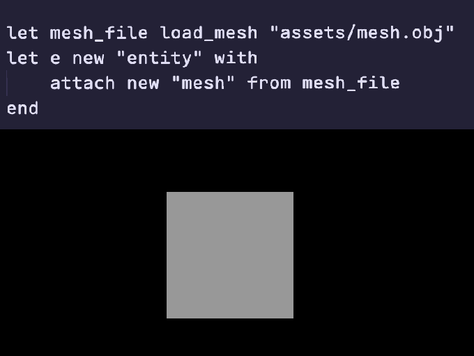
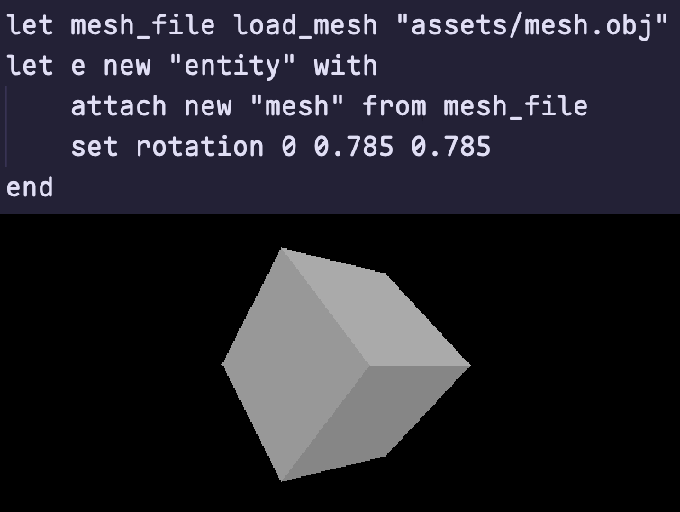
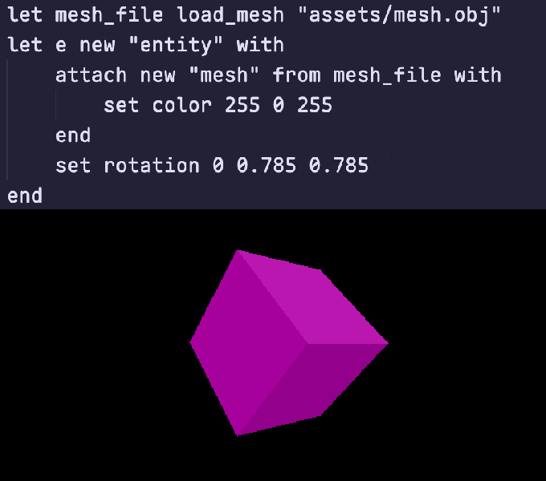

    

## What is microgame?
Microgame is a small game engine for retro-esque video games. 
It will be usable as a custom coding language *and* as a static C library.

## Features
- An ECS scene graph allowing for easy addition of new data
- Collision & velocity built-in
- A small custom coding language for use in the engine

## How to build
1) Make sure you have Raylib installed.
2) Run `make engine`. This creates a `./microgame` executable.
> **NOTE**: You might need to change the makefile. It is set up for MacOS right now.
3) Run the `./microgame` executable. This will run `main.microscript` in the same directory.

## Examples Made in Microgame
### Video example of main.microscript (YouTube):
Click to go to the YouTube video.

### Render a mesh (mesh.obj):

### Rotate the mesh (in radians):

### Color the mesh: 

## Langauge docs
Found [here (MICROSCRIPT.md)](MICROSCRIPT.md).

## Platform Support
> ✅ works 
> ❗️ untested 
> ❌ unsupported

|  Version  |  Distribution  |  MacOS (arm64)  |  MacOS (x86)  |  Linux (arm64)  |  Linux (x86)  |  Windows  |
|:---------:|:--------------:|:---------------:|:-------------:|:---------------:|:-------------:|:---------:|
| dev branch | library | ✅ | ❗️ | ❗️ | ❗️ | ❗️ |
|  | scripting language | ✅ | ❗️ | ❗️ | ❗️ | ❗️ |